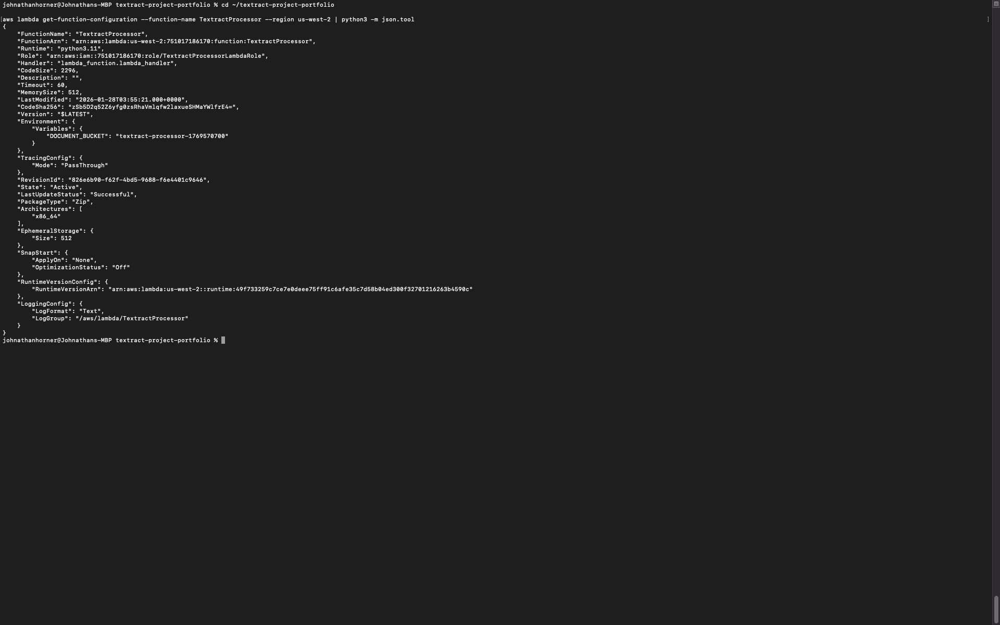
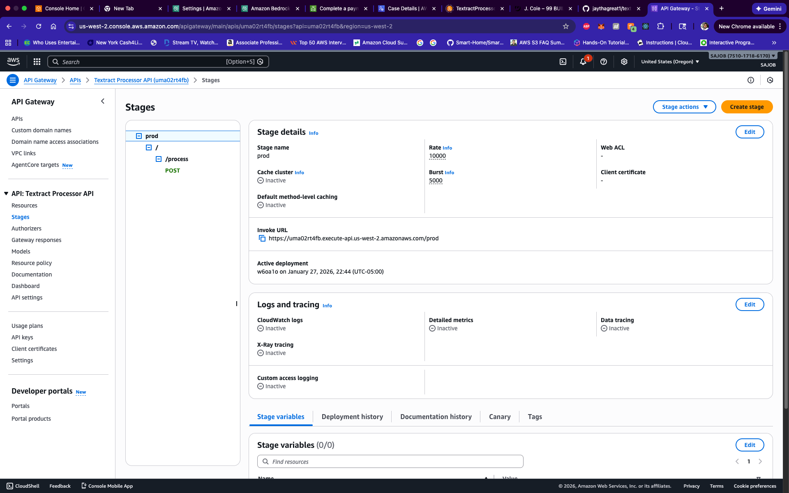
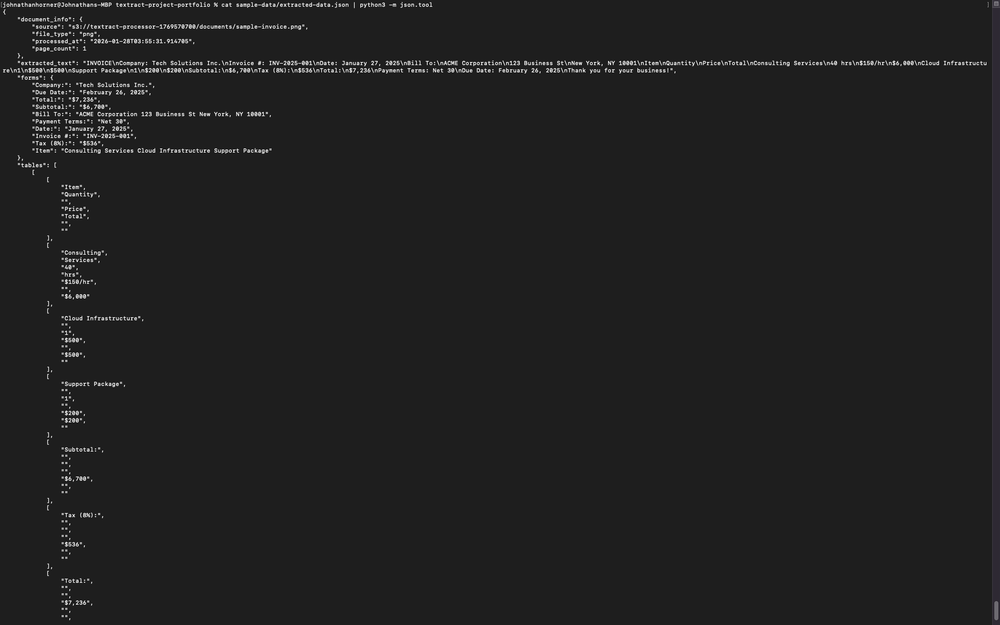

# AWS Textract Document Processor

A production-ready serverless document intelligence system that automatically extracts text, forms, and tables from PDFs and images using AWS Textract.

## 🎯 Overview

This project demonstrates enterprise-grade AWS architecture and AI integration by processing documents through a fully serverless pipeline. Perfect for invoice processing, form digitization, and document archival systems.

**Cost:** $0/month (AWS Free Tier)  
**Processing Time:** 3-5 seconds per document

## ✨ Features

- **Text Extraction**: Automatically extract all text from documents
- **Form Recognition**: Identify and extract key-value pairs
- **Table Detection**: Extract tables with proper structure
- **REST API**: Simple HTTP endpoint for integration
- **Serverless**: Auto-scales from 0 to 10,000 requests/second
- **Cost-Effective**: First 1,000 pages/month free

## 🏗️ Architecture
```
User/Application
    │
    ▼
API Gateway (REST)
    │
    ▼
Lambda Function (Python 3.11)
    │
    ├──────────┐
    ▼          ▼
  S3       Textract
(Storage)   (AI/ML)
    │
    ▼
CloudWatch (Logs)
```

## 🛠️ Technology Stack

- **AWS Textract** - AI-powered document analysis
- **AWS Lambda** - Serverless compute (Python 3.11)
- **Amazon S3** - Document storage
- **API Gateway** - REST API endpoint
- **IAM** - Security and access control
- **CloudWatch** - Logging and monitoring

## 📊 Sample Results

**Input:** Invoice image (800x1000px PNG)

**Statistics:**
- Words extracted: 64
- Lines extracted: 33
- Forms found: 10 key-value pairs
- Tables found: 1
- Processing time: ~3-5 seconds

**Extracted Forms:**
```json
{
  "Company:": "Tech Solutions Inc.",
  "Invoice #:": "INV-2025-001",
  "Total:": "$7,236"
}
```

See [sample-data/extracted-data.json](sample-data/extracted-data.json) for complete results.

## 💼 Business Value

- **Automation**: Eliminates manual data entry
- **Speed**: 3-5 seconds per document
- **Accuracy**: 99%+ AI-powered extraction
- **Scalability**: Handles 1-10,000 documents automatically

## 🎯 Use Cases

- Invoice and receipt processing
- Form data extraction
- Document archival and search
- Insurance claims automation
- Contract data extraction

## 🔒 Security

- IAM role-based access control
- Least-privilege permissions
- Private S3 buckets
- HTTPS-only API
- Encrypted data at rest and in transit

## 📸 Screenshots

### Lambda Configuration


### API Gateway


### Extracted Data


## 💰 Cost

**Free Tier:** 1,000 pages/month free  
**After Free Tier:** ~$0.002 per page  
**Project Cost:** $0-5/month for typical usage

## 📚 What I Learned

- Serverless architecture design
- AWS AI/ML service integration
- RESTful API development
- IAM security best practices
- Cloud cost optimization

## 🎓 Skills Demonstrated

- Cloud Architecture
- AI/ML Integration  
- API Development
- Security (IAM, encryption)
- Python (boto3, JSON processing)

## 👨‍💻 Author

Built as a portfolio project to demonstrate AWS Solutions Architect and AI skills.

## 📄 License

MIT License
